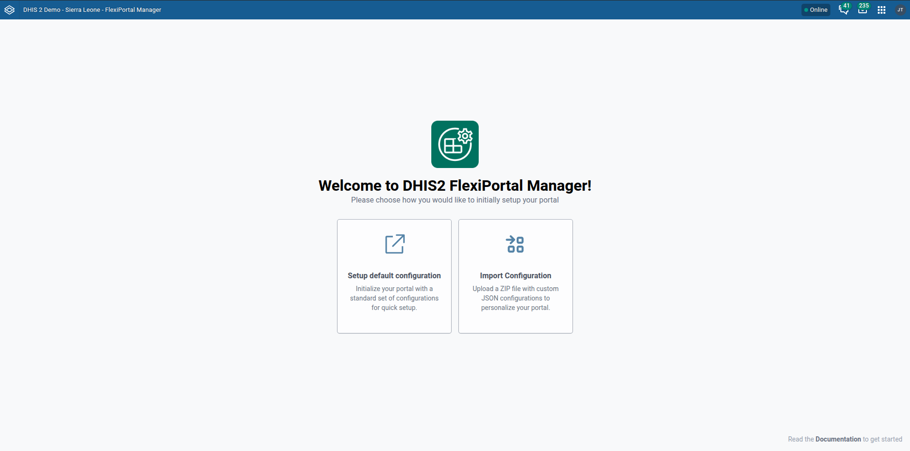
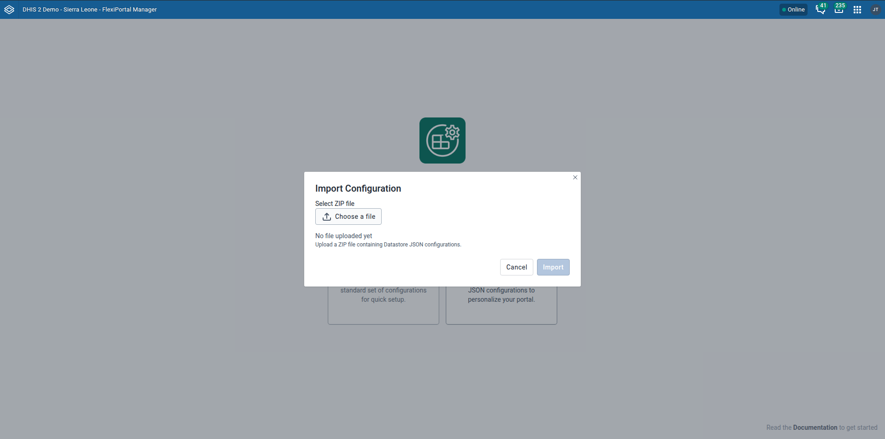
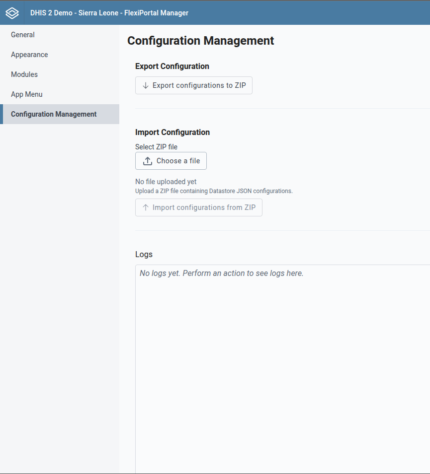

# Configuration Management

This guide provides step-by-step instructions on how to manage and add configurations within the **FlexiPortal** platform.

There are two main ways to manage configurations in FlexiPortal:

1. During the initial setup after installing the application.
2. Through the **Configuration Management** section within the **FlexiPortal Manager** interface.

## 1. Managing Configuration During Initial Setup

During the initial setup, FlexiPortal provides two options for adding configuration :

### Option 1: Setup Default Configuration

This option allows you to initialize your instance with a set of default configurations. The home module be added as default

### Option 2: Import Existing Configuration

You can import a a zip file containing configuration to apply all settings at once. This is useful when you're restoring or cloning an existing FlexiPortal setup.

**Steps:**

1. Click the **“Import Configuration”** button.
2. You’ll be prompted to select a `.zip` configuration file.
3. Once selected, the system will apply the imported configurations to your instance.

>   

## 2. Managing Configuration via the FlexiPortal Manager

The **Configuration Management** section in **FlexiPortal Manager** allows you to manage your instance’s configurations after setup. This allowing you for exporting, importing, and showing importing and exporting logs status.

### 2.1 Export Configuration

This feature allows you to export the current configuration of your FlexiPortal instance into a `.zip` file. It is especially useful for:

- Creating backups
- Transferring configurations between environments or instances

### 2.2 Import Configuration

This functionality enables you to restore or apply an existing configuration from a `.zip` file.

**Steps:**

1. Click **“Select File”** and choose the `.zip` configuration file.
2. Click **“Import Configuration from ZIP”**.
3. The imported configuration will be applied immediately, and the portal will start using the new configuration imported.

### 2.3 Logs

The **Logs** tab provides detailed information about past configuration operations. It logs all import/export actions and their statuses.

This section is useful for :
- Verify whether configurations were successfully imported or exported

