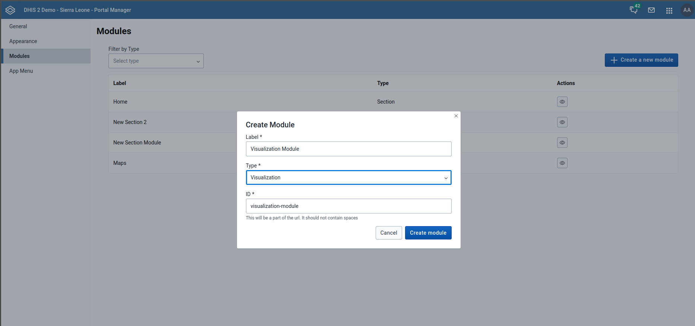
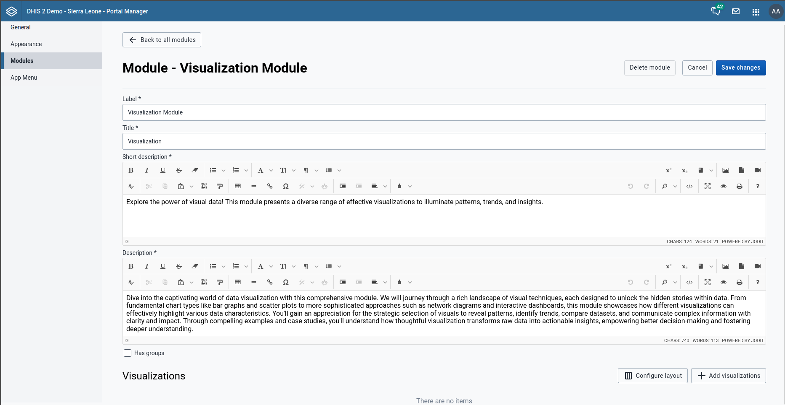

# Visualization Module

## Overview
The Visualization Module allows users to create and manage data visualizations through a flexible interface. This guide covers module creation, configuration, and management for both simple visualizations and grouped visualization sets.

## Table of Contents
- Module Creation
- Basic Configuration (Without Groups)
- Grouped Configuration
- Layout Management
- Editing & Maintenance

---

## 1. Visualization Module Creation

Click the **Create New Module** button to initiate the creation process. A form will appear prompting you to enter:

- **Label** – User-friendly name for your module.
- **Type** – Select module type "Visualization".
- **ID** – Auto-filled from label.
> **Note:**  **ID** is used in the URL and should have no spaces.

Once filled, click **Create**. This opens the module configuration screen.

## 2. Basic Configuration

### 2.1 Core Configuration
Configure in General configuration :
- **Label**
- **Title**
- **Short Description**
- **Description**
- **Has Groups** (Checkbox – default: unchecked)

### 2.2 Adding Visualizations
Click **Add Visualization** to add a new visualization. You must specify:

- **Type** of visualization
- **Name** of visualization
- **Caption** detailing the visulization selected 

You can add as many visualizations as needed.

### 2.3 Layout Configuration
Click **Configure Layout** to resize and arrange visualizations for different screen sizes.

- Use the **Screen Size Dropdown** to configure layouts per device (e.g., mobile, tablet, desktop).
- Use drag-and-drop interface to adjust and structure your visualizations for each screen size,
- click **Update Layout** to save.

You will be navigated back to the module.
![Layout Configuration Screen]

---

## 3. Grouped Configuration

### 3.1 Group Setup
Enable **Has Groups** checkbox

When **Has Groups** is **checked** additional UI elements will appear:

#### Group Selector

Choose between:
- **Segmented** – Groups appear as segmented buttons
- **Dropdown** – Groups appear in a dropdown

### 3.2 Creating Groups
Click **+ Add Group**  to open a new group form

 Fill in:
   - **Group Title**: Display name
   - **Short Name**: Compact identifier
   - **ID**: Auto-generated from title
Click **Create Group**

### 3.3 Group Configuration

After creating a group, configure the following:

- **Short Description**
- **Description**

Visualizations can also be added within a group using the same process:

1. **Add Visualization** – Select type, name, and caption.
2. **Configure Layout** – Adjust for screen sizes.
3. **Save Changes** – Ensure changes are applied.

You can:
- Add more groups
- Edit existing ones
- Delete unwanted groups

---

 ## Deleting a Module

Modules can be deleted entirely from the module overview screen.

> ⚠️ **Note:** Deleting a module will remove all its visualizations and groups.

## Summary

| Feature | Description |
|--------|-------------|
| **Create Module** | Define label, type, and ID |
| **Configure Layout** | Customize visualization layout for multiple screens |
| **Has Groups** | Toggle between grouped and flat visualizations |
| **Add/Edit/Delete** | Full CRUD control on visualizations and groups |
| **Responsive Design** | Layouts optimized per screen size |

---

## Best Practices
- Always use URL-safe IDs (no spaces or special characters).
- Regularly save progress during configuration.
- Organize groups meaningfully when using group mode.
- Test layouts on multiple screen sizes to ensure optimal display

> **Important:** Always click **Save Changes** after making modifications to preserve your work.

---