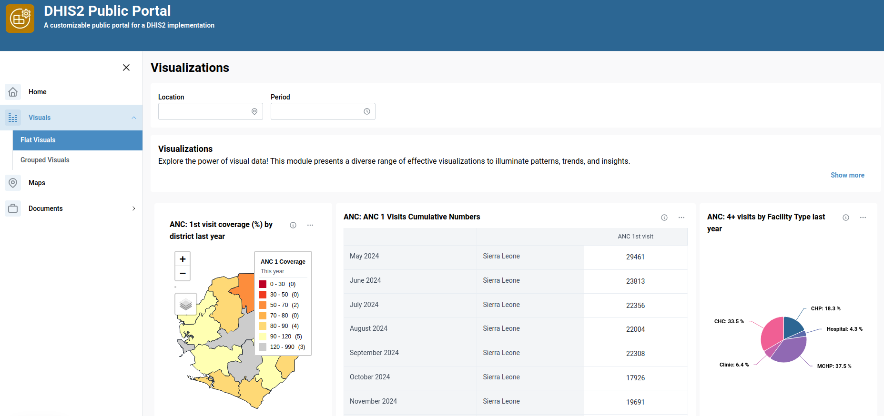
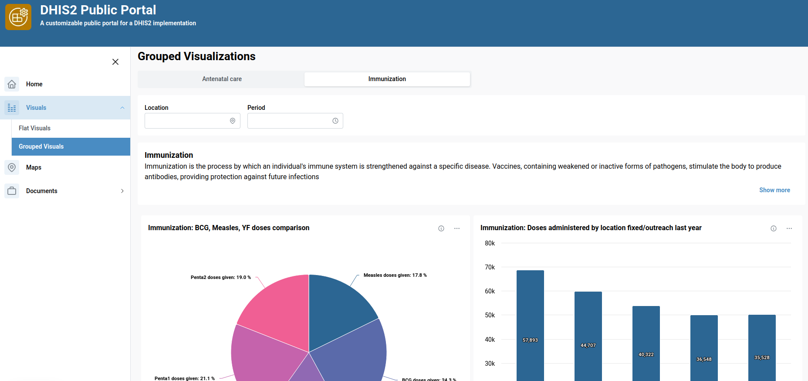
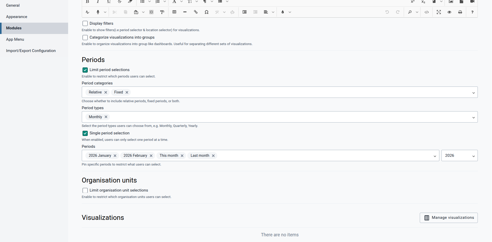
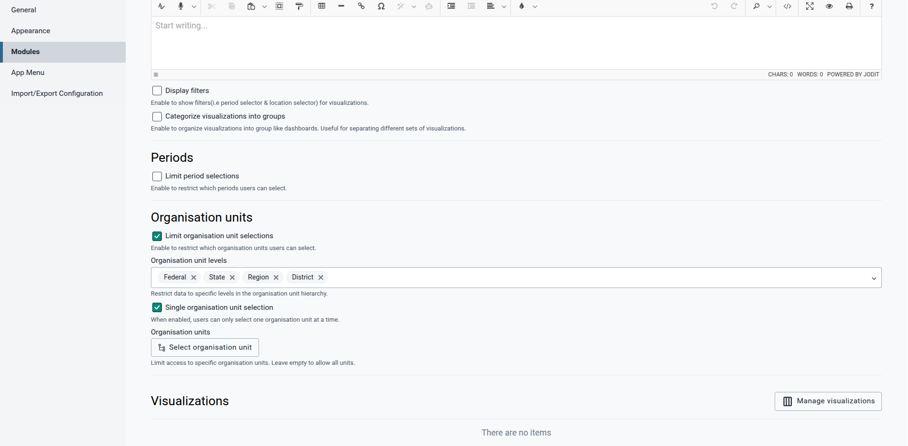
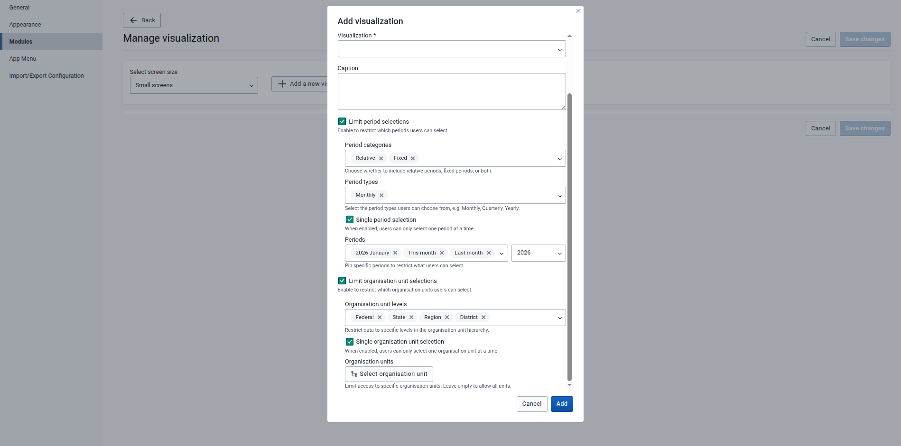

# Visualization Module

## Overview

The **Visualization Module** allows users to create and manage data visualizations through a flexible interface.

This guide covers **module creation**, **configuration**, and **management** for both simple visualizations and grouped visualization sets.

---

## 1. Visualization Module Creation

To create a new visualization module, navigate to the Modules page.

Click the **Create a new module** button to initiate the creation process. A form will appear prompting you to enter:

- **Label** – User-friendly name for your module.
- **Type** – Module type `"Visualization"`.
- **ID** – Auto-filled from label (used in URL paths; must contain no spaces).
    > **Note:** The **Label** can be a short display name, while the **Title** (configured later) is more descriptive.

Once filled, click **Create**. This opens the module configuration screen.

## 2. Basic Configuration

### Core Configuration

Configure in General configuration :

- **Label**
- **Title**
- **Short Description**
- **Description**
- **Categorize visualization into groups** (Checkbox – default: unchecked) Leave unchecked for flat/non-grouped layout.

### Adding Visualizations

Click **Manage visualization** to add new visualizations and configure their layouts. Afterwards click **Add Visualization** to add a new visualization. You must specify:

- **Type** of visualization
- **Name** of visualization
- **Caption** detailing the visualization selected

You can add as many visualizations as needed.

Once you’ve added visualizations, you can adjust and arrange visualizations for different screen sizes.

- Use the **Screen Size Dropdown** to configure layouts per device (e.g., mobile, tablet, desktop).

> Expected Outcome:
> 

## 3. Grouped Configuration

> Use this setup if you want to organize visualizations into categories or tabs.

### Group Setup

Enable **Categorize visualization into groups** checkbox

When **Categorize visualization into groups** is **checked** additional UI elements will appear:

#### Group Selector

Choose between:

- **Segmented** – Groups appear as segmented buttons
- **Dropdown** – Groups appear in a dropdown menu

### Creating Groups

Click **+ Add Group** to open a new group form

Fill in:

- **Group Title**: Display name
- **Short Name**: Compact identifier
- **ID**: Auto-filled from title
  Click **Create Group** to save it

### Group Configuration

After creating a group, configure the following:

- **Short Description**
- **Description**

You can then manage visualizations to the group using the same process:

1. **Add Visualization** – Select type, name, and caption.
2. **Configure Layout** – Adjust for screen sizes.
3. **Save Changes** – Ensure changes are applied.

You can:

- Add more groups
- Edit existing ones
- Delete unwanted groups

> Expected Outcome:
> 

---

## 4. Dimensions Configuration

Admins can control which **period** and **organisation unit** options are available to users when they interact with a visualization module on the portal. This configuration exists at two levels:

- **Module level** applies as defaults to all visualizations within the module (configured in General Configuration)
- **Visualization level** overrides or further restricts options for a specific visualization (configured in the Add/Edit Visualization form)

> When both levels are configured, the visualization level config takes precedence for that specific visualization.

---

### 4.1 Module-Level Dimensions (General Configuration)

Open a Visualization Module and go to **General Configuration**. Scroll down past the display settings to find the **Periods** and **Organisation Units** sections.

#### Periods

Enable **Limit period selections** to reveal the period restriction fields.

> 

| Field                       | Description                                                                                                                                    |
| --------------------------- | ---------------------------------------------------------------------------------------------------------------------------------------------- |
| **Period Categories**       | Choose whether users can select `RELATIVE` periods, `FIXED` periods, or both. Leaving this empty allows both.                                  |
| **Period Types**            | Restrict which period types (e.g. Monthly, Quarterly, Yearly) are available. Only period types belonging to the selected categories are shown. |
| **Single period selection** | When enabled, users can only pick one period at a time in the portal.                                                                          |
| **Periods**                 | Pin specific individual periods. When set, only these exact periods will be selectable all others are hidden.                                  |

#### Organisation Units

Enable **Limit organisation unit selections** to reveal the org unit restriction fields.

<!-- snippet: DashboardGeneralConfig.tsx  the "Organisation units" section with limitOrgUnits checkbox and its children -->

> 

| Field                                  | Description                                                                                                                   |
| -------------------------------------- | ----------------------------------------------------------------------------------------------------------------------------- |
| **Organisation unit levels**           | Restrict the org unit tree to specific hierarchy levels (e.g. District, Facility).                                            |
| **Single organisation unit selection** | When enabled, users can only pick one org unit at a time in the portal.                                                       |
| **Organisation units**                 | Limit access to specific org units by selecting them explicitly. Leave empty to allow all units within the configured levels. |

---

### 4.2 Visualization Level Dimensions (Add / Edit Visualization)

When adding or editing an individual visualization, the same **Limit period selections** and **Limit organisation unit selections** toggles appear below the caption field. These work identically to the module level fields above but apply only to that single visualization.

> 

> **Tip:** Use the visualization level config to tighten restrictions beyond what the module sets for example, pinning a specific period for one chart while leaving the rest of the module flexible.

---

### 4.3 How the Two Levels Interact

| Scenario                            | Behaviour                                                                                        |
| ----------------------------------- | ------------------------------------------------------------------------------------------------ |
| Only module level config set        | All visualizations inherit those restrictions                                                    |
| Only visualization level config set | That visualization uses its own config; others are unrestricted                                  |
| Both levels set                     | The visualization level config is used for that visualization; module config applies to the rest |
| Neither set                         | Users see all available periods and org units (no restrictions)                                  |

---

## 5. Deleting a Module

Modules can be deleted entirely from the module overview screen.

> ⚠️ **Warning:** Deleting a module will remove all its visualizations and groups permanently.

## 6. Summary

| Feature                                  | Description                                                            |
| ---------------------------------------- | ---------------------------------------------------------------------- |
| **Create Module**                        | Define label, type, and ID                                             |
| **Configure Layout**                     | Customize visualization layout for multiple screens                    |
| **Categorize visualization into groups** | Toggle between grouped and flat visualizations                         |
| **Add/Edit/Delete**                      | Full CRUD control on visualizations and groups                         |
| **Responsive Design**                    | Layouts optimized per screen size                                      |
| **Module level Dimensions**              | Set default period and org unit restrictions for all visualizations    |
| **Visualization level Dimensions**       | Override period and org unit restrictions per individual visualization |

---

## 7. Best Practices

- Always use URL-safe IDs (no spaces or special characters).
- Regularly save progress during configuration.
- Organize groups meaningfully when using group mode.
- Test layouts on multiple screen sizes to ensure optimal display

> 💡 Got ideas or suggestions? Reach out to the team to request new features!

---
